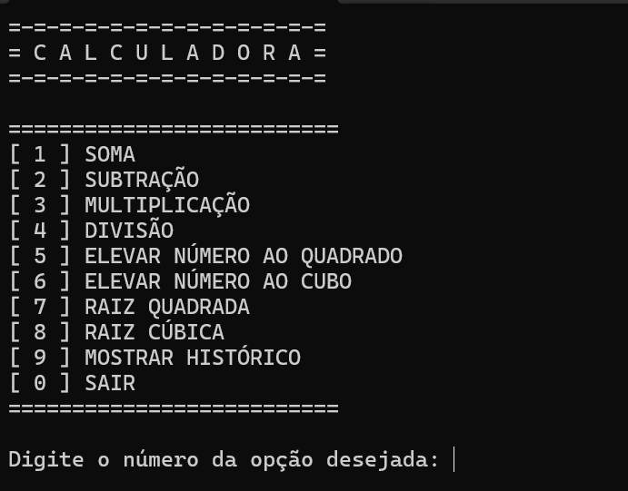
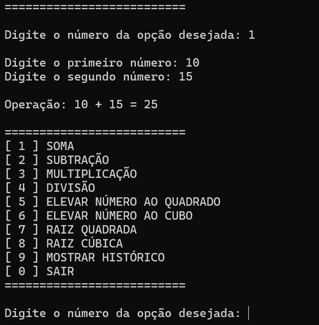
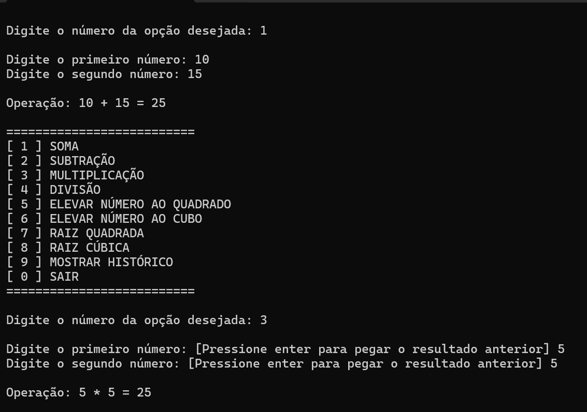
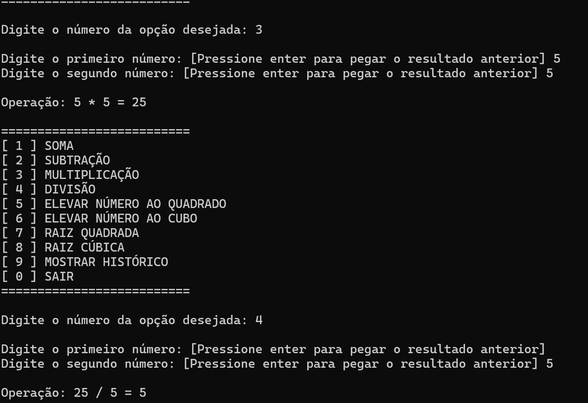
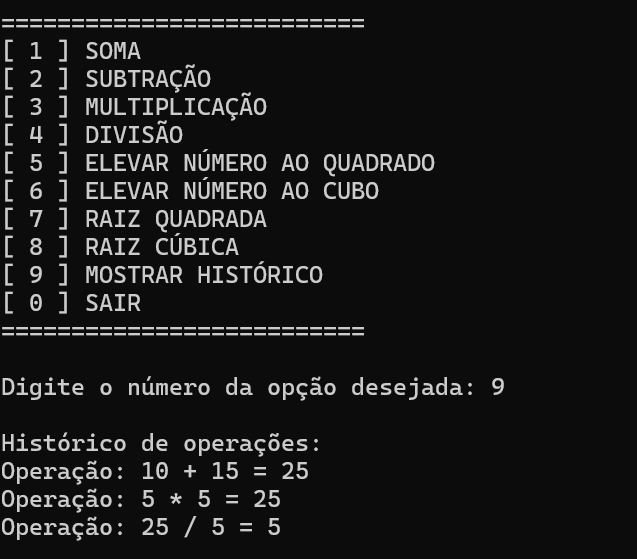

# Projeto-POO-Calculadora

Projeto de uma calculadora simples com histório de operações, por meio de uma aplicação de console, com o intuito de aplicar conhecimentos sobre o Paradigma de Orientação á objetos.

## Imagens do funcionamento

